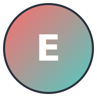

# Electromania - AI Automation Solutions

A modern React application showcasing AI automation solutions, built with TypeScript, Tailwind CSS, and Framer Motion.



## Features

### 1. Modern UI Components

- **Responsive Navbar**: Animated navigation with mobile menu support
- **Hero Section**: Eye-catching gradient background with AI pattern overlay
- **Feature Cards**: Animated cards highlighting key services
- **Statistics Display**: Clean presentation of company metrics
- **Image Grid**: Showcase of solutions with hover effects
- **Newsletter Subscription**: Formik-powered form with validation

### 2. Animations & Interactions

- Smooth page transitions using Framer Motion
- Scroll-triggered animations for feature cards
- Hover effects on interactive elements
- Intersection Observer for element visibility
- Custom SVG patterns and backgrounds

### 3. Design System

- Custom color palette with primary (#FF6B6B) and secondary (#4ECDC4) colors
- Space Grotesk font for headings
- Outfit font for body text
- Consistent spacing and typography
- Responsive design for all screen sizes

## Tech Stack

- **Frontend Framework**: React with TypeScript
- **Styling**: Tailwind CSS with DaisyUI
- **Animations**: Framer Motion
- **Form Handling**: Formik with Yup validation
- **Icons**: Heroicons
- **Routing**: React Router v6
- **State Management**: React Hooks

## Getting Started

1. **Clone the repository**

   ```bash
   git clone https://github.com/yourusername/electromania.git
   cd electromania
   ```

2. **Install dependencies**

   ```bash
   npm install
   ```

3. **Generate logo assets**

   ```bash
   # Install sharp for image processing
   npm install --save-dev sharp

   # Run the conversion script
   node scripts/convert-logos.js
   ```

4. **Start the development server**
   ```bash
   npm start
   ```

## Project Structure

```
electromania/
├── public/
│   ├── images/
│   │   ├── ai-pattern.svg
│   │   ├── ai-automation.svg
│   │   ├── avatar.svg
│   │   ├── chatbot.svg
│   │   ├── logo192.svg
│   │   └── logo512.svg
│   ├── favicon.ico
│   └── manifest.json
├── src/
│   ├── components/
│   │   ├── Navbar.tsx
│   │   └── Footer.tsx
│   ├── pages/
│   │   ├── Home.tsx
│   │   ├── About.tsx
│   │   └── Contact.tsx
│   ├── App.tsx
│   └── index.tsx
├── scripts/
│   └── convert-logos.js
├── package.json
└── README.md
```

## Design Decisions

### Typography

- **Headings**: Space Grotesk for a modern, tech-forward look
- **Body**: Outfit for excellent readability
- **Gradients**: Used for visual hierarchy and brand recognition

### Colors

- **Primary**: #FF6B6B (Coral) - Energy and innovation
- **Secondary**: #4ECDC4 (Turquoise) - Trust and technology
- **Background**: White with subtle patterns for depth
- **Text**: Dark neutral colors for readability

### Animations

- Subtle transitions for enhanced user experience
- Scroll-triggered animations for engagement
- Hover effects for interactive elements
- Loading states for dynamic content

## Browser Support

- Chrome (latest)
- Firefox (latest)
- Safari (latest)
- Edge (latest)

## Contributing

1. Fork the repository
2. Create your feature branch (`git checkout -b feature/amazing-feature`)
3. Commit your changes (`git commit -m 'Add some amazing feature'`)
4. Push to the branch (`git push origin feature/amazing-feature`)
5. Open a Pull Request

## License

This project is licensed under the MIT License - see the LICENSE file for details.

## Acknowledgments

- Icons by [Heroicons](https://heroicons.com/)
- UI Components by [DaisyUI](https://daisyui.com/)
- Animations powered by [Framer Motion](https://www.framer.com/motion/)
